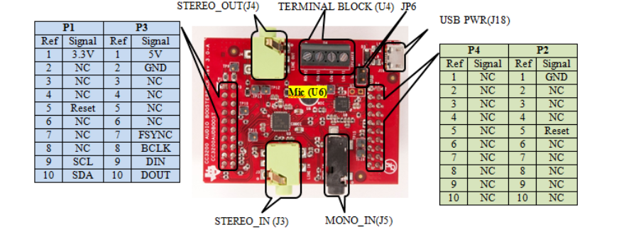

# SimpleLink&trade; CC35X1ET LaunchPad&trade; Settings & Resources

The [__SimpleLink&trade; CC35X1ET LaunchPad&trade;__][board] contains a
[__CC3551ETIARSHR__][device] device.

## Jumper Settings

* Close the __`LEDs`__ jumpers to enable the on-board LEDs.

## SysConfig Board File

The [LP_EM_CC35X1ET.syscfg.json](../.meta/LP_EM_CC35X1ET.syscfg.json)
is a handcrafted file used by SysConfig. It describes the physical pin-out
and components on the LaunchPad.

## Driver Examples Resources

Examples utilize SysConfig to generate software configurations into
the __ti_drivers_config.c__ and __ti_drivers_config.h__ files. The SysConfig
user interface can be utilized to determine pins and resources used.
Information on pins and resources used is also present in both generated files.

## TI BoosterPacks&trade;

The following BoosterPack is used with some driver examples.

### [__CC3200 Audio BoosterPack__][cc3200audboost]

The BoosterPack's `DIN`, `DOUT`, `BCLK` and `FSYNC`/`WCLK` signal pins are not
compatible with this LaunchPad. Use the following modifications to enable the
CC3200 Audio BoosterPack's usage with the __i2secho__ example.

On the LP_EM_CC35X1ET board, bend down the following BoosterPack header pins:

* `BP.30`

Be sure that the bent pins do not make contact with the IC or any other
component, bend them enough to make sure they don't connect to the CC3200
Audio BoosterPack.

Attach the CC3200 Audio BoosterPack to the LP_EM_CC35X1ET and run jumper wires
between the following pins on the CC3200 Audio BoosterPack:

* DIN: `P1.3` and `P3.9`
* DOUT: `P1.4` and `P3.10`
* BCLK: `P4.3` and `P3.8`
* FSYNC/WCLK: `P4.4` and `P3.7`

See [Audio BP User Guide][cc3200audboost-user-guide] (Figure 2-1), or the diagram
below, for information on where these pins are located.

[device]: https://www.ti.com/product/CC35X1ET
[board]: https://www.ti.com/tool/LP-EM-CC35X1ET
[cc3200audboost]: https://www.ti.com/tool/CC3200AUDBOOST
[cc3200audboost-user-guide]: https://www.ti.com/lit/pdf/swru383
